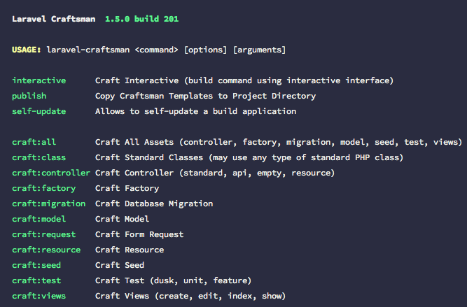

# Laravel Craftsman

## Description

Laravel Craftsman (written using the awesome [Laravel-Zero](https://www.laravel-zero.com) CLI builder) provides a suite of crafting assets using a project agnostic CLI.

You can quickly create `class`, `controller`, `factory`, `migration`, `model`, `form-request`, `resource`, `seed` and `view` assets.
In addition, you can create all assets with a single command, allowing you to quickly craft a new resource in seconds!

📝 [Laravel News Article](https://laravel-news.com/laravel-craftsman-cli)

📦 [Packagist](https://packagist.org/packages/codedungeon/laravel-craftsman)

<h1 align="center">
	
</h1>

## Table Of Conents

- [Installation](#installation)
- [Usage](#usage)
- [Commands](#commands)
- [Tips](#tips)
- [Custom Templates](#custom-templates)
- [License](#license)
- [Credits](#credits)

## Installation

### Using Composer

```bash
> composer global require codedungeon/laravel-craftsman
```

### Using curl/wget

```bash
> curl -o laravel-craftsman https://github.com/mikeerickson/laravel-craftsman/archive/master.zip

or

> wget https://github.com/mikeerickson/laravel-craftsman/archive/master.zip
```

## Usage

```bash
> laravel-craftsman <command> [options] [arguments]

> laravel-craftsman craft:all Post --model App/Models/Post --tablename posts --rows 50 --extends layouts.app --section content

> laravel-craftsman craft:class App/TestClass --constructor

> laravel-craftsman craft:controller PostController --model App/Models/Post

> laravel-craftsman craft:factory PostFactory --model App/Models/Post

> laravel-craftsman craft:migration create_posts_table --model App/Models/Post --tablename posts

> laravel-craftsman craft:model App/Models/Post --tablename posts

> laravel-craftsman craft:request CustomerRequest --rules "title?required|unique|posts,body?required"

> laravel-craftsman craft:seed PostTableSeeder --model App/Models/Post --rows 100

> laravel-craftsman craft:views authors --extends partials.master --section content

```

## Commands

The following commands are available in any Laravel project. You can use the individual crafting routines which are similar to the Artisan commands, but the `craft:all` command is the most powerful of the bunch.

Using `craft:all` you can easily generate all assets (controller, factory, migration, model, and seed) for a given resource (ie Post, Customer, etc)

```bash
laravel-craftsman craft:all Contact \
  --model App/Models/Contact \
  --tablename contacts \
  --rows 50 \
  --fields "first_name:string@30:nullable,last_name:string@50:nullable,email:string@80:nullable:unique"
```

| Command               | Name / Option       | Description                                                                          |
| --------------------- | ------------------- | ------------------------------------------------------------------------------------ |
| **craft:interactive** |                     | **Run Interactive Mode (uses wizard to craft resources**                             |
|                       | --silent, -s        | Skips Wizard Instructions                                                            |
| **craft:all**         | **base name**       | **Creates all assets (Controller, Factory, Migration, Model, Seed)**                 |
|                       | --model, -m         | Path to model (eg App/Models/Post)                                                   |
|                       | --tablename, -t     | Tablename used in database (will set \$tablename in Model)                           |
|                       |                     | _If not supplied, default table will be pluralized model name_                       |
|                       | --rows, -r          | Number of rows used by seed when using Factory                                       |
|                       | --extends, -x       | View extends block (optional)                                                        |
|                       | --section, -i       | View section block (optional)                                                        |
|                       | --no-controller, -c | Do not create controller                                                             |
|                       | --no-factory, -a    | Do not create factory                                                                |
|                       | --no-migration, -g  | Do not create migration                                                              |
|                       | --no-model, -o      | Do not create model                                                                  |
|                       | --no-seed, -s       | Do not create seed                                                                   |
|                       | --no-views, -e      | Do not create seed                                                                   |
| **craft:class**       | **class name**      | **Creates empty class**                                                              |
|                       | --constructor, -c   | Include constructor method                                                           |
|                       | --template, -t      | Path to custom template (override config file)                                       |
|                       | --overwrite, -w     | Overwrite existing class                                                             |
| **craft:controller**  | **controller name** | **Create controller using supplied options**                                         |
|                       | --model, -m         | Path to model (eg App/Models/Post)                                                   |
|                       | --validation, -l    | Create validation blocks where appropriate                                           |
|                       | --api, -a           | Create API controller (skips create and update methods)                              |
|                       | --binding, -b       | Include route / model binding (requires model property)                              |
|                       | --empty, -e         | Create empty controller                                                              |
|                       | --template, -t      | Path to custom template (override config file)                                       |
|                       | --overwrite, -w     | Overwrite existing class                                                             |
| **craft:factory**     | **factory name**    | **Creates factory using supplied options**                                           |
|                       | --model, -m         | Path to model (eg App/Models/Post)                                                   |
| **craft:migration**   | **migration name**  | **Creates migration using supplied options**                                         |
|                       | --model, -m         | Path to model (eg App/Models/Post)                                                   |
|                       | --tablename, -t     | Tablename used in database (will set \$tablename in Model)                           |
|                       |                     | _If not supplied, default table will be pluralized model name_                       |
|                       | --fields, -f        | List of fields (option) _see syntax below_                                           |
|                       |                     | **🚨 If you have spaces separating fields, you must surround fields list in quotes** |
|                       | --down, -d          | Include down methods (skipped by default)                                            |
|                       | --template, -t      | Path to custom template (override config file)                                       |
|                       | --overwrite, -w     | Overwrite existing class                                                             |
| **craft:model**       | **model name**      | **Creates model using supplied options**                                             |
|                       |                     | _See below about defining alternate model path_                                      |
|                       | --tablename, -t     | Tablename used in database (will set \$tablename in Model)                           |
|                       |                     | _If not supplied, default table will be pluralized model name_                       |
|                       | --template, -m      | Path to custom template (override config file)                                       |
|                       | --overwrite, -w     | Overwrite existing class                                                             |
| **craft:request**     | **request name**    | **Creates form request using supplied options**                                      |
|                       |                     | _See below about defining alternate model path_                                      |
|                       | --rules, -r         | List of rules (optional)                                                             |
|                       |                     | **🚨 If you have spaces separating fields, you must surround rules lists in quotes** |
|                       | --template, -m      | Path to custom template (override config file)                                       |
|                       | --overwrite, -w     | Overwrite existing class                                                             |
| **craft:seed**        | **base seed name**  | **Creates seed file using supplied options**                                         |
|                       | --model, -m         | Path to model (eg App/Models/Post)                                                   |
|                       | --rows, -r          | Number of rows to use in factory call (Optional)                                     |
|                       | --template, -t      | Path to custom template (override config file)                                       |
|                       | --overwrite, -w     | Overwrite existing class                                                             |
| **craft:views**       | **base resource**   | **Creates view files**                                                               |
|                       | --extends, -x       | Includes extends block using supplied layout                                         |
|                       | --section, -s       | Includes section block using supplied name                                           |
|                       | --no-create, -c     | Exclude create view                                                                  |
|                       | --no-edit, -d       | Exclude edit view                                                                    |
|                       | --no-index, -i      | Exclude index view                                                                   |
|                       | --no-show, -w       | Exclude show view                                                                    |

### Defining Class Path

When crafting resources which are not automatically created in their assigned directories, you can define the location to the path where asset is created as follows:

```bash
> laravel-craftsman craft:class App/Services/Sync ...
```

This will create a class in the `App/Services` path, with filename `Sync.php`. Directories (including nested directories) will be created if they do not already exists.

#### Supported Commands:

The following commands support defining class path

-   craft:class
-   craft:factory
-   craft:model
-   craft:seed
-   craft:test

### Single Use Template

In addition to the standard templates, you may also define a single use template which is only used during command execution. Single use templates are designed to reference project specific templates, and you use the `<projet>` keyword when executing the desire command.

```bash
> laravel-craftsman craft:class App/Services/SyncService --template "<project>/templates/service.mustache" ...
```

### oh-my-zsh Conflict

If you have `oh-my-zsh` installed, make sure you wrap template value in quotes, otherwise you may receive an error

```bash
laravel-craftsman craft:class TestService --template <project>/templates/custom.mustache --overwrite
zsh: no such file or directory: project
```

### Field Option Syntax

When using the `--fields` option when building migrations, you should use the following syntax:

```
format:
fieldName:fieldType@fieldSize:option1:option2:option3

example:
email:string@80:nullable:unique

--fields "fname:string@25:nullable,lname:string@50:nullable,email:string@80:nullable:unique,dob:datetime,notes:text,deleted_at:timezone"

    Schema::create('contacts', function (Blueprint $table) {
        $table->bigIncrements('id');
        $table->timestamps();
        $table->string('fname', 25)->nullable();
        $table->string('lname', 50)->nullable();
        $table->string('email', 80)->nullable()->unique();
        $table->datetime('dob');
        $table->text('notes');
        $table->timezone('deleted_at');
    });
```

### Rules Option Syntax

When using the `--rules` option when building form requests, you should use the following syntax:

```
format:
ruleName?rule1|rule2|rule3,ruleName2?rule1|rule2
```

```bash
> laravel-craftsman craft:request CustomerRequest --rules "title?required|unique|posts,body?required"
```

Produces the following

```php
public function rules()
{
    return [
        "title" => "required|unique|posts",
        "body" => "required",
    ];
}
```

## Tips

### Boolean Option Shortcut

When executing any of the `laravel-craftsman` commands, if you wish to apply one or more switches (those options which do not require a corresponding value), you can use the standard CLI shorthands (this tip can be used in any CLI based tool, not just `laravel-craftsman` (well assuming the CLI actually supports shorthand).

For example:

Lets assume you wish to wish to create `views`, you can use the following command to skip creation of the create (-c), edit (-d) and show (-w) views (only creating the index view). The combination of `-cdw` is shorthand for `--no-create --no-edit --no-show`

```bash
> laravel-craftsman craft:views --extends layouts.app --section content -cdw
```

is same as

```bash
> laravel-craftsman craft:views --extends layouts.app --section content --no-create --no-edit --no-show

> laravel-craftsman craft:views --extends layouts.app --section content -c -d -w
```

### Defining Nested Paths

Any command can store assets within tested folders within default path by separating `name` argument with forward slash
For example, the following command will define the path for model asset in the `App/Models/<name>` path

```bash
> laravel-craftsman App/Models/Customer ...
```

## Custom Templates

Laravel Craftsman provides support for creating custom templates if you wish to change the syntax to match your personal style. The default templates use the standard Laravel syntax, but we like to allow ou have your own flair.

### User Customized Templates

If you wish to create derivatives of the supported templates, you can customize the `config.php` located in the `laravel-craftsman` directory.
By default, this will be `~/.composer/vendor/codedungeon/laravel-craftsman`, but may be different depending on the method you chose to install laravel-craftsman.

```php
    'templates' => [
            'class' => 'user_templates/class.mustache',
            'api-controller' => 'user_templates/api-controller.mustache',
            'binding-controller' => 'user_templates/binding-controller.mustache',
            'empty-controller' => 'user_templates/empty-controller.mustache',
            'controller' => 'user_templates/controller.mustache',
            'factory' => 'user_templates/factory.mustache',
            'migration' => 'user_templates/migration.mustache',
            'model' => 'user_templates/model.mustache',
            'request' => 'user_templates/request.mustache',
            'seed' => 'user_templates/seed.mustache',
            'view-create' => 'user_templates/view-create.mustache',
            'view-edit' => 'user_templates/view-edit.mustache',
            'view-index' => 'user_templates/view-index.mustache',
            'view-show' => 'user_templates/view-show.mustache',
        ],
```

### Single Use Template

In addition to creating templates and configuring the `config.php` file, you may optionally supply a template to be used as single use (not stored) from all command execution
For example, if you wish to create a standard class asset, you can use a single use template as follows:

```bash

> laravel-craftsman craft:class App/Services/Syncronize --template <project>/templates/service.mustache`


```

### Template Variables

The following variables can be used in any of the supported templates (review the `templates` directory for a basis of how to create custom templates)

| Variable Name | Templates which variable is used                                                            |
| ------------- | ------------------------------------------------------------------------------------------- |
| `binding`     | Used by `binding controller`                                                                |
| `fields`      | Used by `migration`                                                                         |
| `model`       | Used by `api-controller`, `class`, `controller`, `factory`, `migration`, `model` and `seed` |
| `model_path`  | Used by `api-controller`, `controller`, `factory`, `migration`, `seed`                      |
| `name`        | Used by `api-controller`, `controller` and `empty-controller`                               |
| `namespace`   | Used by `class`, `model`                                                                    |
| `num_rows`    | Used by `seed`                                                                              |
| `rules`       | Used by `request`                                                                           |
| `tablename`   | Used by `controller`, `migration`, `model`                                                  |
| `extends`     | Used by `views`                                                                             |
| `section`     | Used by `views`                                                                             |

## License

Copyright &copy; 2019 Mike Erickson
Released under the MIT license

## Credits

laravel-craftsman written by Mike Erickson

E-Mail: [codedungeon@gmail.com](mailto:codedungeon@gmail.com)

Twitter: [@codedungeon](http://twitter.com/codedungeon)

Website: [codedungeon.io](http://codedungeon.io)
